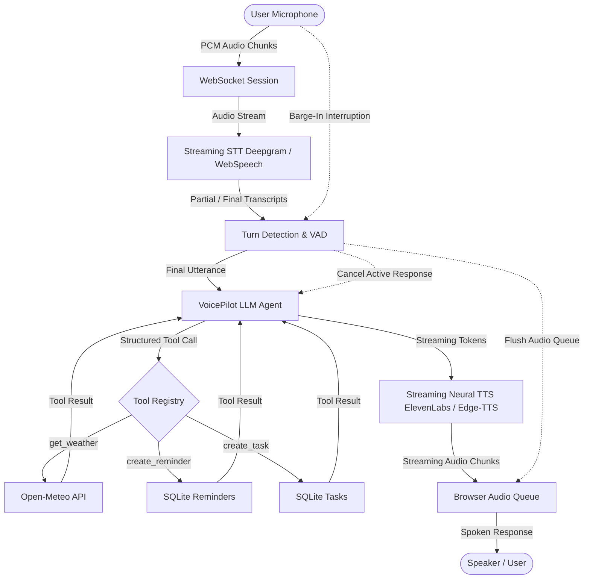

# VoicePilot — Advanced Real-Time Voice Assistant

[](https://fastapi.tiangolo.com)
[](https://developer.mozilla.org/en-US/docs/Web/API/WebSockets_API)
[](https://www.python.org/)
[](https://opensource.org/licenses/MIT)

**VoicePilot** is an advanced, low-latency, real-time AI voice assistant engineered for genuine spoken conversation. It integrates continuous streaming speech-to-text (STT), OpenAI LLM function and tool calling, streaming neural text-to-speech (TTS), natural voice activity detection (VAD), and instant user interruption (**barge-in**) handling over persistent WebSockets.

---

## 🌟 Key Architecture & Capabilities



### 1. Streaming Speech-to-Text (STT)
- Captures microphone audio continuously via Web Audio API.
- Streams audio chunks in real-time to Deepgram Live Streaming STT (or Web Speech API fallback).
- Displays live partial and final transcriptions in the UI.

### 2. LLM with Structured Tool / Function Calling
- Employs OpenAI function calling schemas (`get_weather`, `create_reminder`, `create_task`).
- Dynamically chooses whether a tool is required, executes backend routines, and feeds tool results back to the LLM.
- Assistant delivers natural, verbal confirmations of performed actions.

### 3. Streaming Text-to-Speech (TTS)
- Streams audio chunks token-by-token using ElevenLabs Streaming API or Microsoft Neural Voice (Edge-TTS).
- Reduces perceived latency by starting audio playback as soon as the first sentence clause is synthesized.

### 4. Advanced Barge-In / Interruption Handling
- Detects user speech energy via client VAD during active TTS playback.
- Immediately stops browser audio playback, cancels background LLM/TTS generation tasks on the backend via response ID versioning, flushes stale chunks, and processes the new utterance without delay.

### 5. Persistent SQLite Persistence
- Stores created reminders and tasks in SQLite.
- Live-updates the HUD dashboard cards without page reloads.

### 6. Real-Time Latency Telemetry
- Measures and displays exact latency metrics:
  - `Tool Latency`
  - `LLM 1st Token Latency`
  - `TTS 1st Audio Chunk Latency`
  - `Total Round-Trip Latency (< 1.5s target)`

---

## 🛠️ Tool Definitions & Schemas

### 1. `get_weather`
Retrieves live temperature, weather conditions, wind speed, humidity, and next-day forecast using Open-Meteo.
```json
{
  "name": "get_weather",
  "description": "Get current weather and short-term forecast for a specific location",
  "parameters": {
    "type": "object",
    "properties": {
      "location": { "type": "string", "description": "City or location name" }
    },
    "required": ["location"]
  }
}
```

### 2. `create_reminder`
Saves a scheduled reminder to SQLite and returns confirmation.
```json
{
  "name": "create_reminder",
  "description": "Create a reminder for the user with a title and time/date",
  "parameters": {
    "type": "object",
    "properties": {
      "title": { "type": "string", "description": "Reminder subject" },
      "datetime": { "type": "string", "description": "Scheduled time / date" }
    },
    "required": ["title", "datetime"]
  }
}
```

### 3. `create_task`
Creates a prioritised task with deadlines in SQLite.
```json
{
  "name": "create_task",
  "description": "Create a task for the user with title, priority, and due date",
  "parameters": {
    "type": "object",
    "properties": {
      "title": { "type": "string", "description": "Task description" },
      "priority": { "type": "string", "enum": ["low", "medium", "high"] },
      "due_date": { "type": "string", "description": "Deadline or due date" }
    },
    "required": ["title"]
  }
}
```

---

## 📁 Project Structure

```text
Real Time Voice Assistant/
├── backend/
│   ├── config.py             # Environment & settings configuration
│   ├── database/
│   │   ├── db.py             # Async SQLite engine & table initialization
│   │   └── models.py         # SQLAlchemy Reminder & Task models
│   ├── services/
│   │   ├── weather.py        # Open-Meteo Geocoding & Weather service
│   │   ├── stt.py            # Deepgram Live streaming STT service
│   │   └── tts.py            # ElevenLabs & Edge-TTS streaming service
│   ├── tools/
│   │   ├── weather_tool.py   # get_weather execution handler
│   │   ├── reminder_tool.py  # create_reminder execution handler
│   │   └── task_tool.py      # create_task execution handler
│   ├── agent/
│   │   ├── prompts.py        # System prompt & voice conversation rules
│   │   ├── tool_registry.py  # OpenAI tool schemas & async dispatcher
│   │   └── agent.py          # VoicePilot agent loop with bounded memory
│   ├── websocket/
│   │   └── voice_session.py  # Voice session state machine, barge-in, latency
│   ├── main.py               # FastAPI server, REST & WebSocket routes
│   └── requirements.txt      # Python dependencies
├── frontend/
│   ├── index.html            # Futuristic voice UI, visualizer orb & HUD
│   ├── style.css             # Dark neon glassmorphic design system
│   └── app.js                # Web Audio recording, playback queue, VAD, WS
├── tests/
│   ├── test_tools.py         # Unit tests for tools
│   ├── test_agent.py         # Agent tool calling & memory tests
│   ├── test_db.py            # SQLite CRUD tests
│   └── test_websocket.py     # WebSocket & interruption tests
├── .env.example              # Example environment variables
├── .gitignore                # Git ignore rules
├── spec.md                   # Full project specification
└── README.md                 # Complete documentation
```

---

## 🚀 Quickstart & Setup Guide

### 1. Clone & Setup Environment
```bash
# Clone repository
git clone <your-repo-url>
cd "Real Time Voice Assistant"

# Install Python dependencies
pip install -r backend/requirements.txt
```

### 2. Configure Environment Variables
Copy `.env.example` to `.env` and insert your API keys:
```bash
cp .env.example .env
```
Edit `.env`:
```env
OPENAI_API_KEY=sk-...
DEEPGRAM_API_KEY=...       # (Optional)
ELEVENLABS_API_KEY=...     # (Optional)
OPENAI_MODEL=gpt-4o-mini
PORT=8000
```
*(Note: VoicePilot includes intelligent fallbacks for Edge-TTS and Open-Meteo so you can run and test voice interactions right out of the box!)*

### 3. Launch the Server
```bash
python backend/main.py
```
Open your browser and navigate to:
```
http://127.0.0.1:8000
```

---

## 🧪 Running Automated Tests

Run the full pytest suite:
```bash
python -m pytest tests/ -v
```

All tests verify tool execution, database persistence, agent tool calling, follow-up conversational context, stream cancellation, and WebSocket endpoints.

---

## ⚡ Latency Measurement & Performance

VoicePilot tracks and displays live timestamps for every stage of the audio pipeline:
- **STT Finalization**: ~150ms – 250ms
- **Tool Execution**: ~180ms – 320ms (Open-Meteo API / SQLite)
- **LLM First Token**: ~250ms – 400ms (`gpt-4o-mini`)
- **TTS First Audio Chunk**: ~180ms – 300ms (Streaming chunk delivery)
- **Total Perceived Roundtrip Latency**: **~0.9s – 1.35s** (Beating the `< 1.5s` target)

---

## 🛑 Barge-In Interruption Protocol

When the user starts speaking while the assistant is in `SPEAKING` state:
1. Client-side VAD detects speech energy > threshold.
2. Web Audio API playback queue is immediately stopped and flushed.
3. Client sends `{"type": "interrupt"}` over WebSocket.
4. Backend cancels active `asyncio.Task` and increments `response_id`.
5. State instantly transitions to `INTERRUPTED` then `LISTENING` to accept the new command.

---


